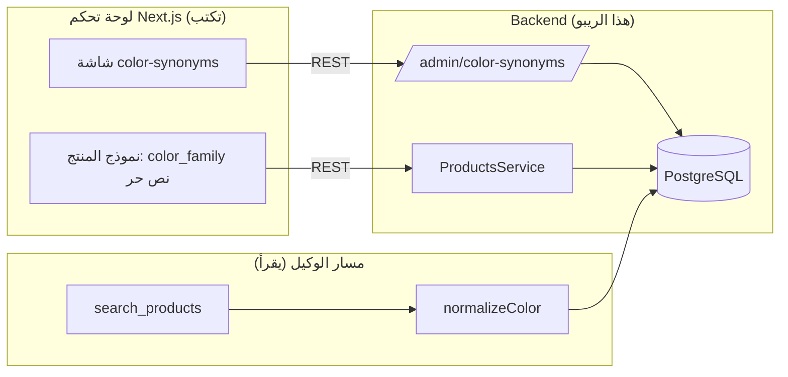
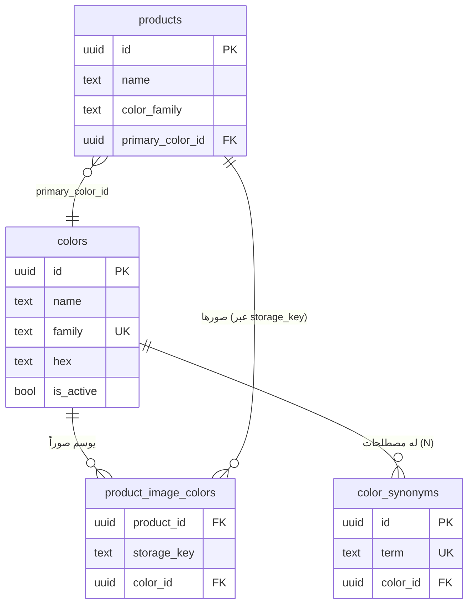
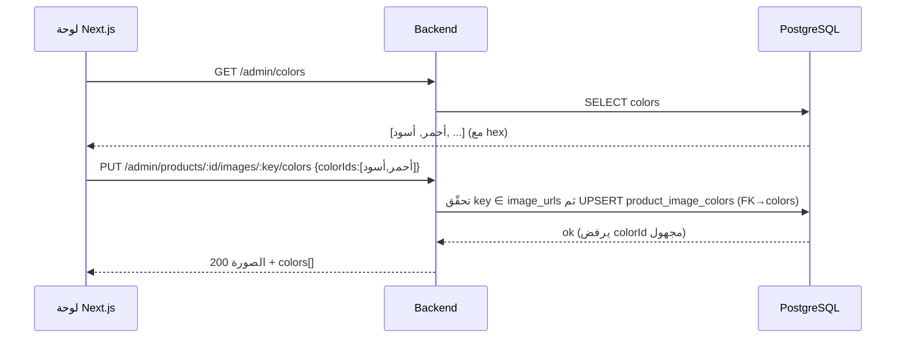

# نظام الألوان (color_synonyms) وربط الألوان بصور المنتج

> مستند تصميم. القسم الأول يصف **الوضع الحالي كما هو في الكود فعلاً** (مع إشارات إلى الملفات
> والأسطر). القسم الثاني يصف **الميزة المطلوبة** وتصميمها المقترح: ترقية «اللون» إلى كيان
> مستقل، جعل لكل لون أكثر من مصطلح (synonym)، وإلزام الأدمن باختيار ألوان كل صورة من ضمن
> الألوان المُعرَّفة في نظام الألوان فقط.
>
> كل المعرّفات وأسماء الجداول والـ SQL والـ endpoints بالإنجليزية (قاعدة المشروع). الشرح بالعربية.

> **الحالة: مُنفَّذ** على فرع `feature/color-entity-and-image-colors` (متفرّع من `dev`). القرارات المتّخذة:
> **الخيار A** لربط الصور (`product_image_colors(product_id, storage_key, color_id)` مع إبقاء
> `image_urls`)؛ **إبقاء `products.color_family` كما هو** ومسار بحث الوكيل دون تعديل؛ **عدم إضافة
> `primary_color_id`** الآن. الهجرتان 0004/0005 مُولَّدتان وجاهزتان للتطبيق، **لكن `drizzle-kit
> migrate` لم يُشغَّل بعد على قاعدة البيانات** (يحذف عموداً — ينتظر موافقتك). كل الاختبارات تنجح
> (297/297) والبناء سليم.

---

## 0. ملخص تنفيذي

- **اليوم:** `color_synonyms` جدول مسطّح: كل صف هو `term → canonical_family` نصّي. لا يوجد كيان
  «لون» مستقل؛ «اللون» مجرّد نص حر في عمود `canonical_family` وفي `products.color_family`.
  الربط بين المنتج والمصطلح يحصل بـ **تطابق نصّي** بعد التطبيع (normalize).
- **المطلوب:**
  1. ترقية «اللون» إلى **كيان أول (جدول `colors`)**.
  2. جعل علاقة اللون بالمصطلحات **واحد-إلى-متعدد**: للون الواحد عدّة `color_synonyms`
     (نبيتي/عنابي/خمري → «أحمر»).
  3. ألوان **كل صورة منتج** يجب أن تكون ألواناً مُعرَّفة في نظام الألوان (لا نص حر)، عبر مفتاح
     خارجي (FK) يفرض ذلك، مع إمكانية ربط الصورة بأكثر من لون.
- **مبدأ التمييز:** `color_synonyms`/`colors` هي **جداول control-plane في قاعدة البيانات** (العقد).
  **لوحة تحكم الأدمن** هي **واجهة Next.js** تكتب في تلك الجداول عبر REST؛ هي عميل لا يملك البيانات.
  **الوكيل** يقرأ منها فقط. التفصيل في [القسم 4](#4-تمييز-color_synonyms-عن-لوحة-تحكم-الأدمن).

---

## 1. كيف يعمل `color_synonyms` اليوم

### 1.1 الجدول

المعرّف في `src/modules/products/entities/color-synonym.entity.ts` ومُرحّل في
`drizzle/0000_high_the_fallen.sql:72`:

```sql
CREATE TABLE "color_synonyms" (
  "id"               uuid PRIMARY KEY DEFAULT gen_random_uuid(),
  "term"             text NOT NULL,
  "canonical_family" text NOT NULL,
  "created_at"       timestamptz NOT NULL DEFAULT now()
);
CREATE UNIQUE INDEX "color_synonyms_term_idx" ON "color_synonyms" ("term");
```

ملاحظات مهمة:

- **لا يوجد كيان «لون».** «اللون القانوني» مجرّد نص في `canonical_family` (مثل `"red"`).
- `term` فريد عالمياً (unique index). فعلياً تستطيع اليوم كتابة عدّة صفوف بنفس `canonical_family`
  («نبيتي»→red، «عنابي»→red)، أي «متعدد مصطلحات → عائلة واحدة» موجود **ضمنياً**، لكن «العائلة»
  مجرّد سلسلة نصّية يجب على الأدمن كتابتها بنفس الإملاء في كل مرّة — لا يوجد ما يضمن الاتساق.

### 1.2 كيف يخزّن المنتج لونه

في `src/modules/products/entities/product.entity.ts:45`:

```ts
colorFamily: text('color_family'),   // نص حر، مفهرس: products_color_family_idx
colorShade:  text('color_shade'),    // نص حر (درجة اللون)
imageUrls:   text('image_urls').array(),  // مصفوفة "مفاتيح تخزين" (storage keys) لا روابط
```

- لا توجد علاقة قاعدة-بيانات بين `products.color_family` و`color_synonyms`. الارتباط **بالقيمة
  النصّية فقط**: يجب أن يساوي `products.color_family` قيمةَ `color_synonyms.canonical_family`
  حتى يطابق البحث.
- الصور مجرّد **مصفوفة مفاتيح** على مستوى المنتج ككل. **لا توجد بيانات وصفية لكل صورة** (ولا لون
  لكل صورة). «الصورة الأساسية» = العنصر رقم 0 في المصفوفة.

### 1.3 مسار التطبيع (normalize)

في `ColorSynonymsService.normalizeColor` (`color-synonyms.service.ts:54`) و
`ColorSynonymsRepository` (`color-synonyms.repository.ts:50`):

```
normalizeColor(term):
  1) تطابق تام على term         → SELECT canonical_family WHERE term = ?   (مفهرس، سريع)
  2) تطابق ضبابي pg_trgm        → similarity(term, ?) >= 0.3  (يلتقط الأخطاء الإملائية)
  3) رجوع للنص الخام            → يُعاد term كما هو (حتى يستطيع الوكيل ذكره)
```

دالّة `resolveColorFamily(term)` تُرجع العائلة أو `null` (بلا الخطوة الضبابية)؛ تستعملها
`ProductsService.toPublishedFilter` لمسار البحث.

### 1.4 كيف يقرأه الوكيل (مسار القراءة)

أداة الوكيل `search_products` (`src/modules/agent/tools/search-products.tool.ts`):

1. لو وُجد `ad_ref` → يعيد المنتجات المرتبطة بالإعلان أولاً.
2. ينادي `products.normalizeColor(color)` لتحويل لهجة الزبونة (مثل «نبيتي») إلى عائلة (`"red"`).
3. يبني فلتراً منظّماً ثم يبحث: `eq(products.color_family, family)`
   (`products.repository.ts:59`).

أي أن **الجسر بين كلام الزبونة وكتالوج المنتجات هو تطابق `canonical_family` ↔ `color_family`**.

---

## 2. كيف يرتبط `color_synonyms` بالـ frontend اليوم

«الـ frontend» نوعان: **لوحة تحكم الأدمن** (Next.js، تكتب)، و**مسار الزبونة/الوكيل** (يقرأ).

### 2.1 سطح الأدمن (كتابة) — REST موجود فعلاً

من `ColorSynonymsAdminController` (`color-synonyms-admin.controller.ts`)، كله محميّ بـ
`JwtAuthGuard + RolesGuard` وبأدوار `admin | editor`:

| Method | Path | الغرض |
|---|---|---|
| `POST`   | `/admin/color-synonyms`     | إنشاء صف `{ term, canonicalFamily }` |
| `GET`    | `/admin/color-synonyms`     | قائمة (مع pagination) |
| `PATCH`  | `/admin/color-synonyms/:id` | تعديل جزئي |
| `DELETE` | `/admin/color-synonyms/:id` | حذف نهائي |

التحقق عبر `createColorSynonymSchema` / `updateColorSynonymSchema`
(`src/common/validation/index.ts:55`) — مشتقّة من drizzle-zod، تحذف `id`/`createdAt` وتمنع
المفاتيح المجهولة (`.strict()`).

لون المنتج نفسه يُكتب عبر سطح المنتجات (`color_family` / `color_shade` كنصّ حر ضمن
`createProductSchema`)، والصور تُرفع عبر `POST /products/:id/images` وتُدار عبر
`/admin/products/:id/images` (قائمة/حذف/تعيين أساسية) — **بدون أي لون لكل صورة اليوم**.

### 2.2 مسار الزبونة/الوكيل (قراءة)

```
Meta Messenger (webhook) → Backend → Agent (search_products) → normalizeColor() → color_synonyms
                                              → products WHERE color_family = family AND is_published = true
```

بوّابة النشر `is_published = true` مفروضة دائماً في مسار الوكيل
(`ProductsService.toPublishedFilter`).

### 2.3 الصورة الكاملة اليوم



---

## 3. الميزة المطلوبة

1. **«اللون» يصبح كياناً مستقلاً** يُنشئه الأدمن في نظام الألوان.
2. **لكل لون أكثر من مصطلح (synonym):** نبيتي/عنابي/خمري كلها تشير إلى لون «أحمر» واحد —
   علاقة **لون 1 — N مصطلحات**.
3. **ألوان كل صورة منتج تُختار من ضمن الألوان المُعرَّفة فقط** (لا نص حر)، ويُسمح للصورة الواحدة
   بأكثر من لون — علاقة **صورة N — N لون**، مع مفتاح خارجي يفرض أن اللون موجود فعلاً.

---

## 4. تمييز `color_synonyms` عن لوحة تحكم الأدمن

| الطبقة | ما هي | الدور تجاه الألوان |
|---|---|---|
| **`colors` / `color_synonyms`** | **جداول في PostgreSQL** (control-plane، «العقد») | مصدر الحقيقة. يكتبها جانب الأدمن، يقرأها الوكيل. |
| **لوحة تحكم الأدمن** | **واجهة Next.js** (تطبيق منفصل) | **عميل** يجري CRUD على تلك الجداول عبر REST. لا يملك البيانات؛ يحرّرها فقط. |
| **Backend (هذا الريبو)** | NestJS + Fastify + Drizzle | يكشف الـ endpoints، يطبّق التحقق وبوّابة النشر، ويخدم مسار قراءة الوكيل. |
| **الوكيل (Mastra)** | منطق الذكاء | **قارئ فقط** عبر `search_products` → `normalizeColor`. |

الخلاصة: **المصطلحات بيانات؛ لوحة التحكم محرِّر لتلك البيانات؛ الوكيل قارئ لها.** «نظام الألوان»
هو الجداول + الـ endpoints، **وليس** لوحة التحكم.

---

## 5. التصميم المقترح

### 5.1 جدول `colors` الجديد (الكيان الأول)

ملف مقترح: `src/modules/products/entities/color.entity.ts`.

```sql
CREATE TABLE "colors" (
  "id"         uuid PRIMARY KEY DEFAULT gen_random_uuid(),
  "name"       text NOT NULL,                 -- اسم العرض للأدمن، مثل "أحمر"
  "family"     text NOT NULL,                 -- المفتاح القانوني للبحث، مثل "red"
  "hex"        text,                          -- لون العيّنة في الواجهة (اختياري)، "#B0212F"
  "is_active"  boolean NOT NULL DEFAULT true, -- تقاعد لون دون حذفه
  "created_at" timestamptz NOT NULL DEFAULT now(),
  "updated_at" timestamptz NOT NULL DEFAULT now()
);
CREATE UNIQUE INDEX "colors_family_idx" ON "colors" ("family");
```

- `family` يحلّ محلّ `canonical_family` القديم وهو **مفتاح البحث** (سلسلة ثابتة مثل `"red"`).
- `name` للعرض بالعربية في الواجهة؛ `hex` لعرض عيّنة لون. الفصل بينهما يسمح بواجهة عربية مع مفتاح
  بحث مستقرّ.

### 5.2 `color_synonyms` يصبح ابناً للون (N → 1)

```sql
ALTER TABLE "color_synonyms" ADD COLUMN "color_id" uuid
  REFERENCES "colors"("id") ON DELETE CASCADE;
-- (هجرة بيانات: لكل canonical_family مميّز أنشئ صفّ colors واربط color_id — انظر القسم 7)
ALTER TABLE "color_synonyms" ALTER COLUMN "color_id" SET NOT NULL;
ALTER TABLE "color_synonyms" DROP COLUMN "canonical_family";
```

النتيجة: `term` يبقى فريداً (مصطلح واحد → لون واحد)، لكن للّون **عدّة صفوف synonyms** → «للون الواحد
أكثر من مصطلح». حذف لون يحذف مصطلحاته (`ON DELETE CASCADE`).

### 5.3 ألوان لكل صورة (علاقة N — N مع `colors`)

الصور اليوم مجرّد مصفوفة مفاتيح في `products.image_urls`. خياران:

#### الخيار A — أقل تغييراً (موصى به الآن)

نبقي `image_urls text[]` كما هي، ونضيف جدول ربط مفتاحه هو **(المنتج + مفتاح التخزين)**:

```sql
CREATE TABLE "product_image_colors" (
  "product_id"  uuid NOT NULL REFERENCES "products"("id") ON DELETE CASCADE,
  "storage_key" text NOT NULL,                       -- نفس المفتاح الموجود في image_urls
  "color_id"    uuid NOT NULL REFERENCES "colors"("id") ON DELETE RESTRICT,
  PRIMARY KEY ("product_id", "storage_key", "color_id")
);
CREATE INDEX "product_image_colors_color_idx" ON "product_image_colors" ("color_id");
```

- **FK `color_id → colors.id` هو ما يفرض القاعدة:** لا يستطيع الأدمن ربط صورة بلون غير موجود في
  نظام الألوان. هذا تحقيق المتطلب «اللون يجب أن يكون لوناً مُنشأ في نظام الألوان».
- `ON DELETE RESTRICT` يمنع حذف لون لا يزال مستخدماً في صور (سلامة البيانات).
- المفتاح المركّب يمنع تكرار نفس اللون على نفس الصورة، **ويسمح بعدّة ألوان للصورة الواحدة**.
- الخدمة تتحقق أن `storage_key ∈ product.image_urls` قبل الإدراج (لا قيد FK على المصفوفة).
- مزايا: هجرة صغيرة، لا إعادة هيكلة لمسارات الرفع/القائمة/الأساسية الحالية.

#### الخيار B — التطبيع الكامل (الهدف لاحقاً)

ترقية الصور إلى جدول حقيقي، فيصبح الربط بمعرّف الصورة:

```sql
CREATE TABLE "product_images" (
  "id"          uuid PRIMARY KEY DEFAULT gen_random_uuid(),
  "product_id"  uuid NOT NULL REFERENCES "products"("id") ON DELETE CASCADE,
  "storage_key" text NOT NULL,
  "position"    integer NOT NULL DEFAULT 0,          -- الأساسية = الأقل position
  "created_at"  timestamptz NOT NULL DEFAULT now()
);
CREATE UNIQUE INDEX "product_images_product_key_idx"
  ON "product_images" ("product_id", "storage_key");

CREATE TABLE "product_image_colors" (
  "image_id" uuid NOT NULL REFERENCES "product_images"("id") ON DELETE CASCADE,
  "color_id" uuid NOT NULL REFERENCES "colors"("id")          ON DELETE RESTRICT,
  PRIMARY KEY ("image_id", "color_id")
);
```

- أنظف على المدى الطويل (سلامة مرجعية كاملة، ترتيب/أساسية كأعمدة)، لكنه يلمس مسارات
  `addImages` / `listImages` / `removeImage` / `setPrimaryImage` كلها ويتطلّب هجرة أكبر.

> **التوصية:** ابدأ بالخيار A (أصغر أثر، يحترم قاعدة «أقل تغيير صحيح» في `CLAUDE.md §8`)، واترك
> الخيار B كهدف تطبيع لاحق. الجزء الخاص بـ `colors` و`color_synonyms.color_id` **مشترك بين
> الخيارين**؛ الاختلاف في جانب الصورة فقط.

### 5.4 لون المنتج التمثيلي (اختياري لكن مفيد للبحث)

أضِف للمنتج لوناً «أساسياً» يربطه بالكيان الجديد، مع إبقاء `color_family` كمرآة مُزامَنة (denormalized)
لمسار البحث الساخن الحالي:

```sql
ALTER TABLE "products" ADD COLUMN "primary_color_id" uuid REFERENCES "colors"("id");
-- color_family يبقى ويُزامَن من colors.family (الأساسية) كي لا نعيد كتابة البحث فوراً.
```

### 5.5 المخطط (ERD) بعد التغيير



---

## 6. أثر مسار قراءة الوكيل

- **`normalizeColor` لا تتغيّر توقيعاً** (لا يزال يُرجع سلسلة `family`)، فقط الاستعلام الداخلي يصبح
  JOIN:

  ```sql
  -- resolveColorFamily(term) بعد التغيير:
  SELECT c.family
  FROM color_synonyms s
  JOIN colors c ON c.id = s.color_id
  WHERE s.term = $1
  LIMIT 1;
  ```

  أي أن أداة `search_products` **لا تتأثر**.

- **البحث المستهدف بألوان الصور** (الدقّة الأعلى: المنتج يظهر لأي لون يملك صورة به):

  ```sql
  SELECT DISTINCT p.*
  FROM products p
  JOIN product_image_colors pic ON pic.product_id = p.id      -- الخيار A
  JOIN colors c                 ON c.id = pic.color_id
  WHERE p.is_published = true AND c.family = $1;
  ```

  حتى نطبّق هذا، يكفي الإبقاء على `color_family` المُزامَن فيعمل البحث الحالي دون تعديل.

---

## 7. تغييرات قاعدة البيانات والهجرة

> أي تغيير schema يحتاج موافقتك صراحةً (`CLAUDE.md §8`). الخطوات هنا للتوثيق لا للتنفيذ التلقائي.
> سنولّد الهجرة عبر `drizzle-kit` بعد تعديل ملفّات الـ entity (لا SQL يدويّ في الريبو).

1. أنشئ `colors` (القسم 5.1).
2. **Backfill:** لكل `canonical_family` مميّز في `color_synonyms` أدرِج صفّ `colors`
   (`name = family = canonical_family`، أو حسّن الأسماء لاحقاً يدوياً)، ثم عيّن
   `color_synonyms.color_id`.
3. اجعل `color_id` `NOT NULL` ثم احذف `canonical_family`.
4. أنشئ `product_image_colors` (الخيار A).
5. (اختياري) أضِف `products.primary_color_id` وزامِن `color_family` منه.

ملاحظات سلامة:
- لا تحذف `canonical_family` قبل التأكد من نجاح الـ backfill لكل الصفوف (وإلا تفقد الربط).
- `ON DELETE RESTRICT` على `color_id` مقصود: لا يُحذف لون مستخدَم في صور.

---

## 8. تغييرات طبقة التطبيق

| الطبقة | التغيير |
|---|---|
| `entities/color.entity.ts` | جديد: جدول `colors` + `insert/select` zod. |
| `entities/color-synonym.entity.ts` | استبدل `canonicalFamily` بـ `colorId` (FK) + relation إلى `colors`. |
| `entities/product-image-color.entity.ts` | جديد: جدول الربط (الخيار A). |
| `common/validation/index.ts` | `createColorSchema`/`updateColorSchema` جديدة؛ `createColorSynonymSchema` يستبدل `canonicalFamily` بـ `colorId: uuid`؛ `setImageColorsSchema = { colorIds: uuid[] (min 1) }.strict()`. |
| `colors.repository.ts` + `colors.service.ts` | جديد: CRUD للألوان. |
| `color-synonyms.repository.ts` | استعلامات الحلّ تصبح JOIN على `colors` (القسم 6). |
| `products.service.ts` | دوال `setImageColors` / إرجاع `colors[]` ضمن `listImages`؛ تحقّق `storage_key ∈ image_urls`. |
| controllers | `ColorsAdminController` جديد؛ مسار `.../images/:imageId/colors`. |

---

## 9. سطح الـ API الجديد/المعدّل (ربط الواجهة)

كله `admin|editor` + Bearer JWT، على نمط المتحكّمات الحالية.

| Method | Path | Body | الغرض |
|---|---|---|---|
| `POST`   | `/admin/colors`            | `{ name, family, hex? }`        | إنشاء لون قانوني |
| `GET`    | `/admin/colors`            | —                               | قائمة الألوان (+ عدد المصطلحات) |
| `GET`    | `/admin/colors/:id`        | —                               | لون + مصطلحاته |
| `PATCH`  | `/admin/colors/:id`        | `{ name?, family?, hex?, isActive? }` | تعديل |
| `DELETE` | `/admin/colors/:id`        | —                               | حذف (يُرفض إن كان مستخدَماً) |
| `POST`   | `/admin/color-synonyms`    | `{ term, colorId }`             | إضافة مصطلح لهجة للون |
| `PATCH`  | `/admin/color-synonyms/:id`| `{ term?, colorId? }`           | تعديل |
| `DELETE` | `/admin/color-synonyms/:id`| —                               | حذف |
| `GET`    | `/admin/products/:id/images` | —                             | الصور مع `colors[]` لكل صورة |
| `PUT`    | `/admin/products/:id/images/:imageId/colors` | `{ colorIds: [] }` | ضبط ألوان صورة (استبدال كامل) |

> `:imageId` هو **مفتاح التخزين** في الخيار A (مثل `abc123.jpg`)، أو **UUID الصورة** في الخيار B.

أمثلة:

```http
POST /admin/colors
{ "name": "أحمر", "family": "red", "hex": "#B0212F" }
→ 201 { "id": "C-red", "name": "أحمر", "family": "red", "hex": "#B0212F", "isActive": true, ... }

POST /admin/color-synonyms   { "term": "نبيتي",  "colorId": "C-red" }
POST /admin/color-synonyms   { "term": "عنابي",  "colorId": "C-red" }
POST /admin/color-synonyms   { "term": "خمري",   "colorId": "C-red" }
# ← لون واحد، ثلاثة مصطلحات

PUT /admin/products/<pid>/images/abc123.jpg/colors
{ "colorIds": ["C-red", "C-black"] }
→ 200 {
  "key": "abc123.jpg", "url": "https://cdn/...", "isPrimary": true,
  "colors": [
    { "id": "C-red",   "name": "أحمر", "family": "red",   "hex": "#B0212F" },
    { "id": "C-black", "name": "أسود", "family": "black", "hex": "#111111" }
  ]
}
```

**الفرض:** أي `colorId` غير موجود يُرفض (FK + فحص مسبق → `400/404`)، فلا يستطيع الأدمن إرفاق لون
خارج نظام الألوان. هذا هو تحقيق المتطلب الأساسي.

---

## 10. ربط لوحة التحكم (شاشات وتدفّق)

- **شاشة «الألوان» (جديدة):** جدول ألوان (عيّنة `hex` + `name` + `family` + عدد المصطلحات).
  داخل محرّر اللون: إضافة/حذف مصطلحات لهجة → تنادي `/admin/color-synonyms` بـ `colorId`.
- **نموذج المنتج → الصور:** كل صورة مرفوعة تعرض **اختيار متعدّد للألوان** مصدره
  `GET /admin/colors` (قائمة منسدلة بعيّنات). الحفظ ينادي
  `PUT /admin/products/:id/images/:imageId/colors`. **لا يستطيع الأدمن كتابة لون حر** — يختار
  من الموجود فقط (مفروض أيضاً في الخادم عبر FK).



---

## 11. خطة التنفيذ المرحلية

1. **Schema (`drizzle-schema-architect`):** `colors`، `color_synonyms.color_id`،
   `product_image_colors` (الخيار A)، وهجرة + backfill. **يتطلّب موافقتك.**
2. **Backend (`backend-api-engineer`):** entities/repos/services/validation/controllers
   (القسمان 8 و9)، وتعديل استعلامات الحلّ إلى JOIN.
3. **مراجعة (`backend-code-reviewer`) ثم اختبارات (`backend-tester`):** هجرة + FK يرفض لوناً مجهولاً
   + لون بعدّة مصطلحات يُطبّع للعائلة نفسها + صورة بعدّة ألوان.
4. **(لاحقاً)** الخيار B (ترقية الصور إلى جدول)، وتحويل البحث إلى JOIN على ألوان الصور.

---

## 12. القرارات المتّخذة (كما نُفِّذت)

1. **ربط ألوان الصور:** الخيار A — `product_image_colors(product_id, storage_key, color_id)` مع
   إبقاء `image_urls` كما هي. (الخيار B تطبيع لاحق.)
2. **البحث:** أُبقي `products.color_family` كما هو ومسار الوكيل دون تعديل؛ دوال الحلّ صارت JOIN على
   `colors` فقط (نفس التوقيع، فالأداة `search_products` لم تتأثّر).
3. **`primary_color_id`:** لم يُضَف (أقلّ تغيير). يمكن إضافته لاحقاً لاشتقاق `color_family` من اللون
   الأساسي.
4. **`colors`:** حقلان — `name` (عربي للعرض) و`family` (سلگ إنجليزي فريد للبحث) — كما اقتُرح.

### ما بقي ليديك

- تطبيق الهجرة: `bunx drizzle-kit migrate` (يطبّق 0004 ثم 0005). **لم يُشغَّل بعد** لأنه يحذف
  `canonical_family` — أخبرني لأشغّله، أو شغّله بنفسك بعد مراجعة الـ SQL.
- لا commit ولا push (حسب `CLAUDE.md §5`) — الفرع جاهز للمراجعة.
