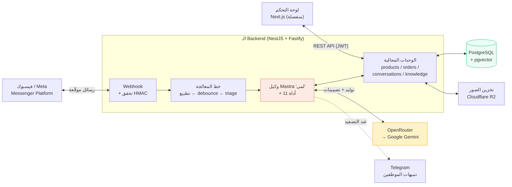
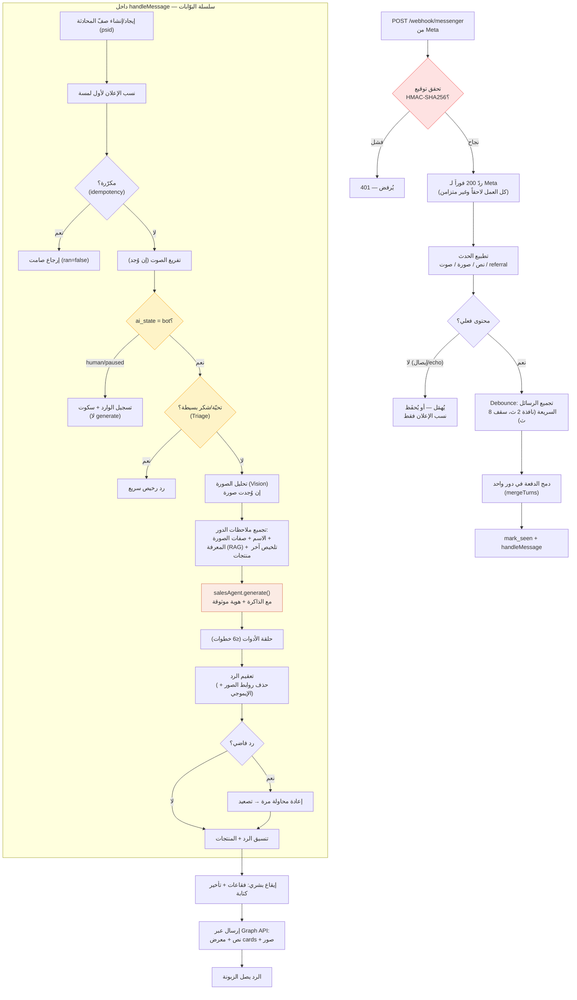
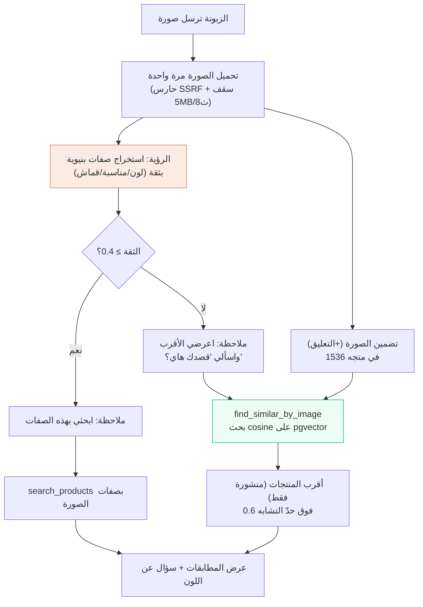
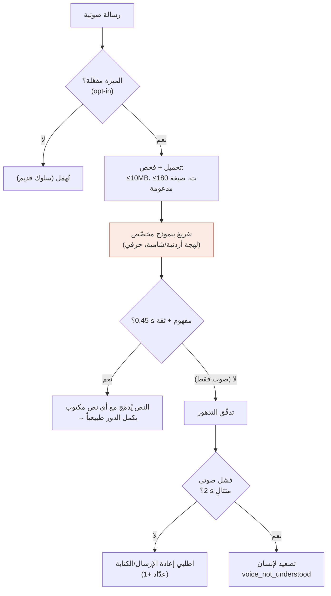
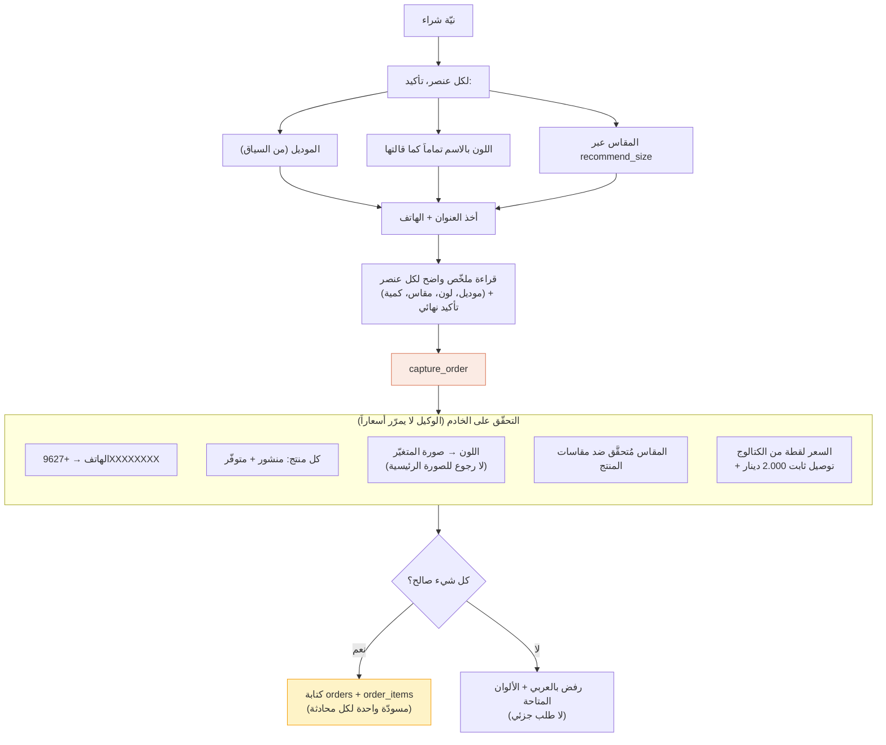
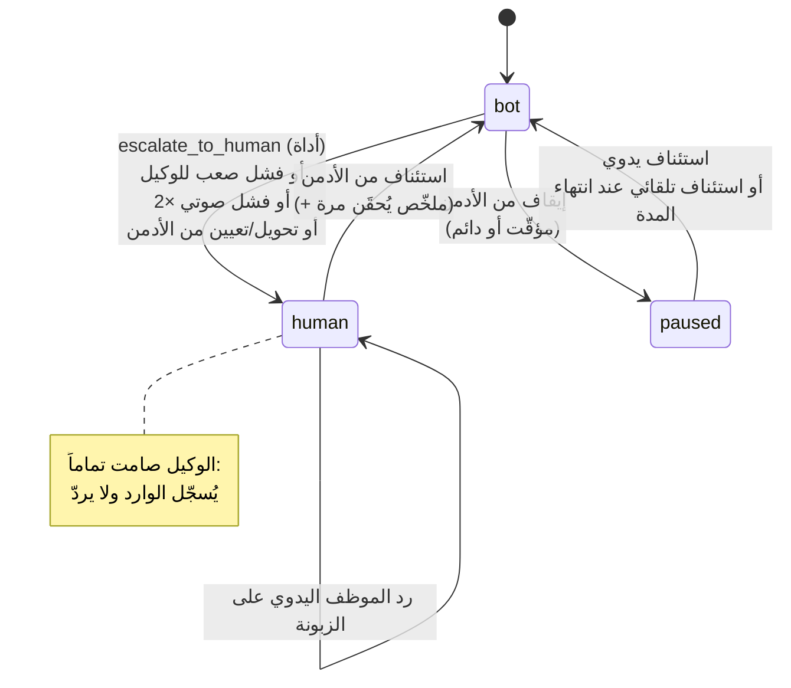
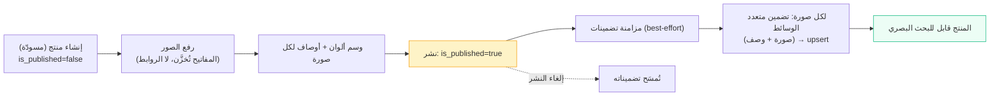
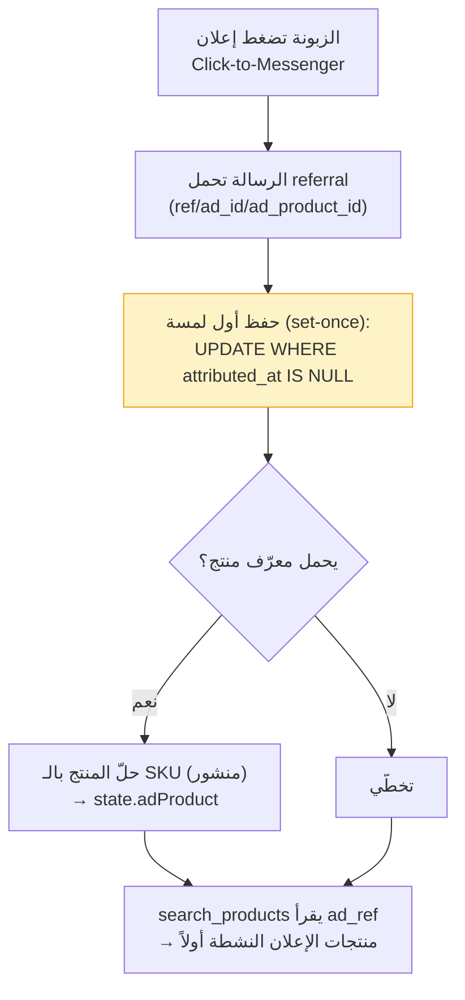

# تحليل الـ Backend لوكيل ماسة — طريقة العمل، الميزات، والتدفقات

> وثيقة تحليلية **وظيفية** (سلوكية) للـ Backend: تشرح *كيف يعمل النظام*، *ما هي الميزات الموجودة*، و*كيف تسير التدفقات (Flows)* — وليست تحليلاً للأكواد.
>
> جميع الحقائق مستخرجة من الكود الفعلي (لا من الوثائق القديمة). حيث تعارض `CLAUDE.md` أو `حالة-المشروع.md` مع الكود، اعتُمد الكود.

---

## 1. نظرة عامة — ما هو النظام؟

الـ Backend هو **دماغ وكيل مبيعات ذكي** اسمه **"لمى"** يردّ على رسائل زبونات صفحة **ماسة (Masa Fashion)** — متجر ملابس نسائية أردني (عبايات، بجامات، فساتين) — على **Facebook Messenger**. مهمّة الوكيل:

- يردّ **باللهجة الأردنية العامية** بصوت البراند (دافئ، ودود، بدون إيموجي، ردود قصيرة).
- يبحث في الكتالوج **بالصفات** (لون، مقاس، مناسبة، سعر) و**بالصور** التي ترسلها الزبونة و**بالصوت** (الرسائل الصوتية).
- **يحفظ سياق المحادثة والزبونة** عبر كل محادثاتها، ويعرف من أي إعلان دخلت.
- **لا يخترع أسعاراً ولا توفّراً أبداً** — كل الحقائق من قاعدة البيانات عبر أدواته.
- **يلتقط طلبات الدفع عند الاستلام (COD)**، و**يحوّل لإنسان** عند الحاجة.

### المبدأ الحاكم للنظام

> **قاعدة البيانات هي مصدر الحقيقة الوحيد.** لوحة التحكم (الأدمن) **تكتب** الكتالوج والمعرفة والشخصية؛ والوكيل **يقرأ** فقط. بوابة النشر `is_published = true` تفصل ما يراه الوكيل/الزبون عمّا هو مسودّة. المال يُخزَّن كنص (`numeric(10,3)` للدينار) ويُحسَب دائماً على الخادم — الوكيل لا يحدّد الأسعار إطلاقاً.

### المعمارية العامة

---

## 2. المكوّنات التقنية وأدوارها

| الطبقة | التقنية | الدور |
|--------|---------|-------|
| Framework | NestJS 11 + **Fastify** | خادم REST + الـ webhook |
| تنسيق الذكاء | **Mastra 1.42** | بناء الوكيل، الأدوات، الذاكرة |
| مزوّد الـ LLM | **OpenRouter → Google Gemini** | كل نداءات النماذج تمرّ عبر OpenRouter |
| قاعدة البيانات | **PostgreSQL** + `pgvector` + `pg_trgm` | مصدر الحقيقة + البحث البصري + البحث الضبابي العربي |
| ORM | **Drizzle** | وصول للبيانات (بدون SQL خام للمنطق) |
| التخزين | **flydrive** (محلي `fs` / Cloudflare **R2**) | صور المنتجات |
| المصادقة | **JWT** + `bcrypt` | لوحة التحكم |
| الإشعارات | **Telegram Bot API** | تنبيه الموظفين عند التصعيد |

### النماذج المستخدمة وأدوارها

| المهمّة | النموذج (الافتراضي) | ملاحظات |
|---------|---------------------|---------|
| **وكيل المبيعات "لمى"** | `gemini-3.5-flash` | temp=0.5، topP=0.8، حد إخراج 768 توكن/خطوة، حد 6 خطوات أدوات |
| **الرؤية (استخراج صفات الصورة)** | نموذج Gemini (lite في مثال البيئة) | مخرجات بنيوية، حدّ ثقة 0.4 |
| **تفريغ الصوت** | `gemini-3.5-flash` | لهجة أردنية/شامية، حدّ ثقة 0.45 |
| **الفرز السريع (Triage)** | `gemini-3.1-flash-lite` | تحيّات/شكر فقط، ~1–2% من التكلفة |
| **التضمينات (Embeddings)** | `gemini-embedding-2` | متعدد الوسائط، بُعد 1536، فهرس HNSW |

> **ملاحظة:** بعض التعليقات في الكود ما زالت تذكر "Claude/Haiku" — هذا **قديم**؛ المزوّد الفعلي المُعدّ هو Gemini عبر OpenRouter. مفتاح `OPENROUTER_API_KEY` مطلوب؛ و`ANTHROPIC_API_KEY` صار اختيارياً.

### فصل قاعدة البيانات إلى مخطّطين (schemas)

- **`public`** — جداول العمل (Drizzle): الكتالوج، الطلبات، المحادثات، سجلّ الرسائل… (مصدر الحقيقة + سجلّ لوحة التحكم).
- **`mastra`** — جداول ذاكرة الوكيل (يديرها Mastra وحده): خيوط المحادثة، سجلّ رسائل الـ LLM، الذاكرة العاملة. معزولة تماماً حتى لا تتداخل الهجرات.

> **تمييز مهم:** جدول `public.messages` هو **سجلّ عمل** للوحة التحكم والتقييم، بينما ذاكرة Mastra هي **سياق الـ LLM**. الاثنان منفصلان ويُكتَبان في مسارَين مختلفين.

---

## 3. الميزات الموجودة (Feature Catalog)

### 3.1 قدرات الوكيل الذكي (تجاه الزبونة)

| الميزة | الوصف | الحالة |
|--------|-------|--------|
| **رد باللهجة الأردنية** | شخصية "لمى" — عامية أردنية، بدون إيموجي، ترحيب مرة واحدة، سؤال واحد لكل رسالة، ردود قصيرة | مُفعّلة |
| **بحث بالصفات** | لون (بأي لهجة)، مقاس، مناسبة، سعر أقصى، نص حر | مُفعّلة |
| **بحث بصري بالصورة** | الزبونة ترسل صورة → النظام يجد أقرب المنتجات بصرياً (pgvector) | مُفعّلة |
| **فهم الصور (Vision)** | استخراج صفات بنيوية من صورة الزبونة (لون، مناسبة، قماش…) لتوجيه البحث | مُفعّلة افتراضياً |
| **فهم الرسائل الصوتية** | تفريغ الرسالة الصوتية إلى نص (لهجة أردنية) قبل الرد | **اختيارية** (opt-in) |
| **ذاكرة عبر المحادثات** | يتذكّر اسم الزبونة، مقاسها، ألوانها المفضّلة، ملاحظات ستايلها عبر كل محادثاتها | مُفعّلة (بدون Semantic Recall بعد) |
| **سياق الإعلان** | يعرف من أي إعلان Click-to-Messenger دخلت الزبونة والمنتج المُعلَن | مُفعّلة |
| **التقاط طلبات COD** | يجمع المنتجات/الألوان/المقاسات/العنوان ويسجّل طلب دفع عند الاستلام | مُفعّلة |
| **توصية مقاس** | من وزن الزبونة (والطول اختياري) حسب مقاسات المنتج نفسه | مُفعّلة |
| **قاعدة معرفة (FAQ)** | يجيب عن الشحن/الإرجاع/الدفع/العناية من معرفة المتجر (RAG) | مُفعّلة (تعتمد على إدخال الأدمن) |
| **حالة الطلب** | "وين صار طلبي؟" — يعرض حالة الطلب بنطاق المحادثة فقط | مُفعّلة |
| **التحويل لإنسان** | عند الشكوى/الاستبدال/طلب موظف/عدم القدرة | مُفعّلة |
| **رد بشري الإيقاع** | تقسيم الرد لفقاعات قصيرة مع مؤشّر "يكتب الآن" وتأخير | مُفعّلة افتراضياً |

### 3.2 قدرات لوحة التحكم (تجاه الموظف/الأدمن)

| المجال | الميزات المتاحة عبر الـ API |
|--------|------------------------------|
| **المنتجات** | إنشاء/تعديل/حذف، مسودّة↔منشور، رفع صور، تعيين صورة رئيسية، وسم ألوان لكل صورة، وصف لكل صورة، فهرسة بصرية |
| **الفئات** | فئات ملابس بمخطط صفات ديناميكي (`attribute_schema`) قابل للتعديل |
| **الألوان والمرادفات** | سجلّ ألوان قانوني + مرادفات لهجية (نبيتي→أحمر)، حذف آمن يعيد الوسم لعنصر "غير معرّف" |
| **روابط الإعلانات** | ربط مرجع إعلان (ad_ref) بمنتج/منتجات لنسب Click-to-Messenger |
| **الطلبات** | قائمة، تفاصيل، إنشاء يدوي (مؤسَّس على الخادم)، تغيير الحالة (draft→confirmed→fulfilled/canceled) |
| **المحادثات (Inbox)** | قائمة مع معاينة آخر رسالة وفلاتر، تثبيت، تحويل، إيقاف/استئناف، تعيين موظف، **رد يدوي على الزبونة**، إعادة تعيين (مسح الذاكرة)، حذف |
| **المعرفة** | إنشاء/تعديل/حذف مدخلات FAQ، عام أو خاص بمنتج، مسودّة↔منشور |
| **شخصية الوكيل** | تعديل شخصية "لمى" (persona/tone/rules/greeting) — صفّ نشِط واحد، يسري خلال ≤60 ثانية بدون إعادة نشر |
| **لوحة المؤشّرات** | إحصاءات المنتجات/الطلبات/المحادثات + مخطط طلبات 7 أيام |

### 3.3 ميزات التشغيل والجودة والأمان

| الميزة | الوصف |
|--------|-------|
| **الفرز السريع (Triage)** | إجابة التحيّات/الشكر بنموذج رخيص لتوفير التكلفة (**اختيارية**) |
| **تنحيف السياق** | تجريد نتائج الأدوات الثقيلة من التاريخ + سقف توكنز (12000) لتقليل الكلفة |
| **التخزين المؤقت للـ prompt** | إبقاء بادئة النظام ثابتة البايتات → خصم Gemini على قراءات الكاش (0.1×) |
| **إزالة التكرار (3 طبقات)** | داخل الطلب + داخل الدفعة + فحص قاعدة بيانات، لمنع معالجة رسالة مرتين |
| **حارس SSRF** | فحص كل رابط وسائط ترسله الزبونة قبل جلبه من الخادم |
| **إشعارات Telegram** | تنبيه فوري للموظفين عند كل تصعيد (اختياري حسب الإعداد) |
| **تتبّع التكلفة** | تقدير التوكنز والدولار لكل دور في السجلّات (لا جدول) |
| **هارنس التقييم (Eval)** | قياس دقّة استرجاع المنتج على مجموعة حالات + تقرير إنتاجي وصفي |
| **معالجة الأعطال** | إعادة محاولة عند الرد الفاضي، تصعيد عند الفشل الصعب، fallback مهذّب |

---

## 4. التدفقات (Flows) — القلب

### 4.1 التدفق الرئيسي: من رسالة الزبونة إلى الرد

هذا هو التدفق المركزي للنظام. يبدأ من وصول الرسالة عبر الـ webhook وينتهي بإرسال الرد.

**الخطوات بالتفصيل:**

1. **الاستقبال والتحقق:** يصل `POST /webhook/messenger`. حارس التوقيع يعيد حساب `HMAC-SHA256` على **البايتات الخام** للجسم بمفتاح `MESSENGER_APP_SECRET` ويقارنه بترويسة `X-Hub-Signature-256` مقارنة زمنية-ثابتة. الفشل → 401. (في الإنتاج بدون سرّ → يُرفض؛ في التطوير بدون سرّ → يُسمح للتسهيل.)

2. **الردّ الفوري لـ Meta:** يُعاد 200 فوراً دائماً (حتى عند خطأ التحليل)، وكل عمل الوكيل يجري **بشكل غير متزامن** بعيداً عن خيط الطلب — حتى لا تُعيد Meta الإرسال.

3. **التطبيع:** يُستخرَج من الحدث: النص (مع أولوية للـ quick reply ثم النص ثم الـ postback)، أول صورة، أول صوت، وبيانات الـ referral (مرجع الإعلان). أحداث بلا محتوى (إيصالات التسليم/القراءة، الأصداء) تُهمَل. إذا كان الحدث بلا محتوى لكنه يحمل referral → تُحفَظ نسبة الإعلان فقط دون تشغيل دور.

4. **التجميع (Debounce):** الزبونة غالباً ترسل رسائل متتابعة ("بدي عباية" … "حمرا" … "مقاس L"). يُنتظَر **2 ثانية** من الهدوء (بسقف صلب **8 ثوانٍ**) ثم تُدمَج كل الرسائل في **دور واحد** (النصوص تُوصَل بأسطر، وآخر صورة/صوت يفوز).

5. **سلسلة البوّابات داخل `handleMessage`** (بالترتيب):
   - **إزالة التكرار:** إن سبقت معالجة نفس الرسالة (مفتاح = معرّف Meta، أو هاش محتوى+وقت بنافذة 10 ث) → إرجاع صامت.
   - **تفريغ الصوت:** إن وُجدت رسالة صوتية، تُفرَّغ **قبل** بوابة السكوت (حتى المحادثات المُحوّلة لإنسان تحصل على نصّ مقروء في اللوحة).
   - **الاستئناف التلقائي:** إن كانت `paused` وانتهت نافذة الإيقاف → تُعاد إلى `bot` تلقائياً.
   - **بوابة السكوت:** إذا `ai_state ≠ bot` → يُسجَّل الوارد ويُسكَت الوكيل (**لا يُستدعى `generate()`**).
   - **الفرز:** تحيّة/شكر بسيطة (وإن كانت الميزة مفعّلة) → رد رخيص سريع.
   - **الرؤية:** إن وُجدت صورة → استخراج صفاتها (وتُهمَل نسبة الإعلان لصالح تصميم الصورة).
   - **تجميع ملاحظات الدور:** اسم الزبونة + ملاحظة الرؤية + ملاحظة الصوت + المعرفة (RAG) + تلخيص آخر منتجات عُرضت — تُحقَن كـ "ملاحظات نظام" في نهاية السياق (حفاظاً على كاش الـ prompt).

6. **التوليد:** يُستدعى `salesAgent.generate()` مع تحديد الذاكرة (resource=PSID، thread) وهوية موثوقة عبر `requestContext`. الوكيل يشغّل **حلقة أدوات** (حتى 6 خطوات) يقرّر فيها أي أداة يستدعي.

7. **ما بعد التوليد:** يُعقّم الرد (حذف روابط الصور والإيموجي حتمياً). إن كان الرد فاضياً → إعادة محاولة مرة، ثم تصعيد لإنسان إن بقي فاضياً (حتى لا "يسكت الوكيل" فجأة).

8. **الإرسال:** يُنسَّق الرد (فقاعات بشرية الإيقاع مع تأخير كتابة، معرض بطاقات المنتجات حتى 8، وصور المنتجات كرسائل مستقلة) ويُرسَل عبر **Graph API** (`RESPONSE`).

---

### 4.2 تدفق الفرز السريع (Triage) — اختياري

**الغرض:** رسالة مثل "مرحبا" أو "يسلمو" لا تحتاج السياق الكامل (التعليمات + مخططات 11 أداة + التاريخ ≈ 4–12 ألف توكن). الفرز يجيبها بنموذج خفيف بـ ~1–2% من الكلفة.

- يُفعَّل فقط عند `TRIAGE_ENABLED=true` (مُطفأ افتراضياً).
- يُصنّف النص عبر **قائمة بيضاء صارمة** (تحيّة/شكر) بعد تطبيعه، ولا يفرز أي نص أطول من **40 حرفاً**.
- **لا يفرز** الإقرارات المبهمة (اه، تمام، اوك) — لأنها غالباً "نعم، أكّد الطلب".
- يخرج من الفرز إلى المسار الكامل عند: وجود صورة/صوت/إعلان، أو تلخيص تحويل معلّق، أو تحيّة في محادثة أعمارها < دقيقة (أول لمسة، ليعمل الترحيب الأول وتخزين الذاكرة).
- الدور المُفرَز **يُسجَّل** في لوحة التحكم لكن **لا يُضاف** لتاريخ الـ LLM (تبادل اجتماعي لا يستحق إعادة الدفع عليه لاحقاً).

---

### 4.3 تدفق الصورة (الرؤية + البحث البصري)

عندما ترسل الزبونة صورة، هناك **استخدامان متوازيان** لنفس الصورة:

- **مسار الرؤية (Vision):** خطوة **حتمية قبل التوليد** (ليست أداة) — تستخرج صفات مغلقة (اللون من قائمة ألوان الكتالوج) وتُطبِّع اللون لعائلته، ثم تحقنها كملاحظة توجّه `search_products`. لا ترمي استثناءً أبداً؛ عند أي فشل يكمل الدور.
- **مسار البحث البصري (Embeddings):** أداة `find_similar_by_image` تقرأ رابط الصورة من السياق (ليس من مدخلات الـ LLM)، تُضمّنها في متجه متعدد الوسائط (1536 بُعد)، وتبحث بـ **cosine** على فهرس HNSW ضمن المنتجات المنشورة فقط، وتعيد ما يتجاوز حدّ التشابه.
- **قاعدة حاكمة:** تصميم الصورة **يتغلّب** على الإعلان الذي دخلت منه الزبونة (`imageLed=true` يُهمِل مسار الإعلان).

---

### 4.4 تدفق الرسالة الصوتية (Transcription) — اختياري

- يجري التفريغ **قبل** بوابة السكوت، فحتى المحادثات المُحوّلة لإنسان تحصل على نصّ مقروء.
- النموذج مخصّص للصوت (منفصل عن وكيل المبيعات)، يفرّغ **حرفياً** بالعامية دون فصحنة، ويكتب الأرقام (مقاسات/أسعار/هواتف) كأرقام.
- **دور صوتي فقط** (بلا نص مكتوب ولا صورة) بتفريغ غير مفهوم **لا يصل `generate()` أبداً** — بل يطلب إعادة الإرسال؛ وبعد **فشلين متتاليين** يُحوّل لإنسان.

---

### 4.5 تدفق التقاط الطلب (COD) — متعدد العناصر

الطلب قد يشمل عدة موديلات/ألوان. الوكيل يؤكّد **كل عنصر** قبل التسجيل، وكل حسابات المال تجري على الخادم.

- **الهوية مؤسَّسة على الخادم:** `conversationId` و`source` (messenger/whatsapp) من السياق الموثوق، لا من مدخلات الـ LLM.
- **اللون هو المُحدِّد الأساسي:** يُترجَم لصورة المتغيّر عبر وسم ألوان الصور؛ ولون غير قابل للحلّ **يُرفَض** مع سرد الألوان المتاحة (لا رجوع صامت للصورة الرئيسية).
- **رسوم التوصيل ثابتة 2.000 دينار** (بدون شرائح حسب المحافظة).
- **لقطات ثابتة:** يُخزَّن السعر واسم المنتج واللون في `order_items` كلقطة، فلا تتغيّر الطلبات القديمة عند تعديل الكتالوج.
- **ذرّية:** أي فشل تحقّق يُلغي الطلب كاملاً (لا طلبات جزئية). ومسودّة واحدة حيّة لكل محادثة (إعادة الالتقاط تُحرّر المسودّة المفتوحة).
- **دورة حياة الطلب:** `draft → confirmed → fulfilled` (أو `canceled`) — تتقدّم فقط عبر لوحة التحكم.

---

### 4.6 تدفق التحويل لإنسان والعودة (آلة الحالات)

`ai_state` على المحادثة هو **مصدر الحقيقة الوحيد** لمن يتحكّم بالمحادثة، وكل انتقال يُسجَّل في `conversation_events` (سجلّ تدقيق غير قابل للتعديل).

- **ما يُسكِت الوكيل:** أي حالة غير `bot`. الوارد يُسجَّل للموظف، ولا يُستدعى `generate()`.
- **محفّزات التصعيد التلقائي (→ human):** أداة `escalate_to_human`، أو فشل صعب في التوليد، أو فشلان صوتيان متتاليان. (**لا** يوجد تصعيد بكلمات مفتاحية أو حدّ ثقة.)
- **رد الموظف اليدوي:** يتطلّب أن تكون المحادثة **ليست `bot`**؛ يُرسَل عبر Graph API كـ `RESPONSE` ضمن نافذة الـ 24 ساعة أو بوسم `HUMAN_AGENT` خارجها؛ يُحفَظ صفّ الرسالة قبل الإرسال (لا يضيع عند فشل التسليم).
- **الاستئناف التلقائي:** ليس عبر cron — بل يُفحَص `paused_until` عند وصول الرسالة التالية من الزبونة.
- **عند التصعيد:** يُرسَل تنبيه **Telegram** فوري للموظفين (اسم الزبونة عبر Graph best-effort + PSID + رقم المحادثة + السبب).

---

### 4.7 تدفق نشر منتج وفهرسته بصرياً

- المسوّدات **لا تُفهرَس** أبداً؛ النشر يشغّل مزامنة تضمينات لا تُعطّل النشر (fire-and-forget).
- الصور تُخزَّن في R2 كـ **مفاتيح** (storage keys) لا كروابط، وتُحلّ للروابط العامة فقط عند الإخراج — فتبديل مزوّد التخزين لا يحتاج ترحيل بيانات.
- سكربت `embeddings:backfill` يعيد فهرسة كل الصور المنشورة غير المُفهرسة (idempotent)؛ وسكربت `embeddings:probe` أداة "go/no-go" تقيس هل النموذج يميّز العبايات بصرياً قبل الاعتماد على البحث البصري.

---

### 4.8 تدفق نسب الإعلان (Click-to-Messenger)

- نسبة **أول لمسة** ذرّية ولا تُكتَب إلا مرة واحدة (الكاتب الأول يفوز).
- الأدمن يربط مرجع الإعلان بمنتج/منتجات؛ والوكيل يقرأ فقط الروابط **النشطة** لمنتجات **منشورة** مرتّبة بالموضع.
- على دور فيه صورة، يُهمَل مسار الإعلان (تصميم الصورة يفوز).

---

### 4.9 تدفق المعرفة (Knowledge Prefetch / RAG)

- قبل التوليد، وإذا بدت الرسالة سؤالاً معلوماتياً (شحن/توصيل/إرجاع/دفع/قماش/مقاس/ضمان…)، يُحلّ المنتج في السياق (صورة هذا الدور → آخر منتجات عُرضت → منتج الإعلان) وتُحقَن **FAQ** الخاصة به كملاحظة نظام — ليجيب الوكيل من معرفة المتجر **أولاً** بغضّ النظر عن قراره باستدعاء أداة `get_knowledge`.
- الاسترجاع **متدرّج:** المدخلات الخاصة بالمنتج أولاً ثم العامة، بحدّ **5** مدخلات، وبحث عربي ضبابي (`pg_trgm`).
- **مهم:** إن لم توجد معرفة منشورة للسؤال، **لا يخترع** الوكيل سياسة — يقول إنه سيتحقّق أو يُحوّل لإنسان. (قاعدة المعرفة تعتمد على إدخال الأدمن؛ إن كانت فارغة تُحوَّل الأسئلة العامة لإنسان.)

---

### 4.10 تدفق الذاكرة (عبر المحادثات)

- **ذاكرة عاملة على مستوى الزبونة (resource):** مفتاحها PSID، مشتركة عبر **كل** محادثاتها. تحفظ: `name`, `size`, `preferred_colors`, `style_notes`, `last_interested_ad_ref`. الوكيل يحدّثها بأداة `updateWorkingMemory` كلما عرف شيئاً جديداً — فإذا رجعت الزبونة بعد أسبوع نعرف مقاسها.
- **تاريخ الرسائل على مستوى المحادثة (thread):** آخر **10** رسائل تُحمَل في كل نداء.
- **Semantic Recall:** **مُعطّل حالياً** (لم يُربَط مُضمِّن للذاكرة بعد — مُخطَّط لاحقاً).
- **إعادة تعيين المحادثة (من الأدمن):** تمسح الذاكرة العاملة + تاريخ الخيط + حالة المحادثة + تحذف الرسائل — فيُعامَل الوكيل الزبونة كأنها جديدة.

---

## 5. نموذج البيانات — من يكتب ومن يقرأ

**16 جدولاً حيّاً** (عبر هجرات Drizzle حتى `0019`؛ جدول `size_chart` القديم حُذف وصار تحويل الوزن→مقاس لكل منتج داخل `products.sizes`).

### جداول التحكم (الأدمن يكتب / الوكيل يقرأ) — 11 جدولاً

| الجدول | الغرض |
|--------|-------|
| `admin_users` | حسابات لوحة التحكم (أدوار `admin`/`editor`) |
| `agent_behavior` | شخصية الوكيل (persona/tone/rules/greeting) — صفّ نشِط واحد |
| `product_categories` | فئات الملابس + مخطط صفاتها الديناميكي |
| `products` | الكتالوج: الاسم، السعر، عائلة اللون، المقاسات، الصور (مفاتيح)، حالة المخزون، `is_published` |
| `colors` | سجلّ الألوان القانوني (العائلة = مفتاح البحث) |
| `color_synonyms` | المرادفات اللهجية (نبيتي → أحمر) |
| `ad_product_links` | ربط مرجع الإعلان بمنتج (نسب Click-to-Messenger) |
| `product_image_colors` | وسم ألوان لكل صورة (صورة = متغيّر لون) |
| `product_image_descriptions` | وصف إداري لكل صورة (يُضمَّن مع الصورة) |
| `product_image_embeddings` | متجه بصري لكل صورة `vector(1536)` + فهرس HNSW |
| `knowledge_entries` | معرفة/FAQ (عام أو خاص بمنتج)، `is_published` |

### جداول التشغيل (الوكيل يكتب) — 5 جداول

| الجدول | الغرض |
|--------|-------|
| `conversations` | خيط الزبونة (بمفتاح PSID) + `ai_state` + نسب الإعلان + `state` (تفضيلات/مرحلة) |
| `conversation_events` | سجلّ تدقيق غير قابل للتعديل لكل انتقال حالة |
| `messages` | سجلّ الرسائل (customer/agent/human) + مفتاح إزالة التكرار |
| `orders` | طلبات COD (المبالغ لقطات مشتقّة على الخادم) |
| `order_items` | عناصر الطلب (تثبّت المتغيّر = موديل+لون عبر مفتاح الصورة) |

### العلاقات الأساسية

- `products` هو المحور: يشير إليه `order_items`, `ad_product_links`, وجداول الصور الثلاثة، و(اختيارياً) `knowledge_entries` — كلها **cascade** عند الحذف إلا `order_items.product_id` (يُبقي تاريخ الطلبات).
- `colors` ← `color_synonyms` (cascade)، و← وسوم الصور بعلاقة **restrict** (لون مُستخدَم لا يُحذَف — يعود للعنصر "غير معرّف").
- `conversations` محور التشغيل: ← `messages` و`conversation_events` (cascade)، و← `orders` (**set null** — يبقى الطلب لو حُذفت المحادثة).

### قواعد البيانات الحاكمة

- **بوابة النشر** `is_published`: مطبَّقة في **طبقة الخدمة** — مسارات الوكيل/الزبون تفرض `true`، ومسارات الأدمن قد ترى المسوّدات.
- **المال كنص** `numeric(10,3)` للدينار، والحساب بميلي-دينار صحيح (لا floating-point). الـ LLM لا يمرّر مالاً إطلاقاً.
- **هوية الصورة** = `(product_id, storage_key)` (لا جدول صور مستقل)؛ والمفاتيح تُحلّ لروابط عند الإخراج فقط.
- **حذف صلب** في معظم الوحدات، عدا "الحذف الآمن" للألوان (إعادة وسم لعنصر sentinel).

---

## 6. الأدوات الـ11 للوكيل (مرجع سريع)

كل أداة "محوّل رفيع" ينادي خدمة مجالية بلا SQL. الهوية (من هي الزبونة/أي محادثة) تُقرأ من السياق الموثوق لا من مدخلات النموذج.

| الأداة | نوع | الغرض | حدّ حماية بارز |
|--------|------|-------|-----------------|
| `search_products` | قراءة | بحث بالصفات/النص الحر | منشور فقط، تطبيع لهجة اللون |
| `list_all_products` | قراءة | تصفّح الكتالوج | سقف 8 نتائج |
| `check_availability` | قراءة | توفّر منتج + المقاسات/الألوان المتوفّرة | لا تصريح بتوفّر بدونها |
| `get_product_media` | قراءة (+إرسال صور) | إرسال صور منتج مفلترة باللون | الصور كرسائل مستقلة لا روابط بالنص |
| `get_knowledge` | قراءة | استرجاع FAQ/سياسات | منشور فقط، سقف 5، الخاص أولاً |
| `recommend_size` | قراءة | توصية مقاس من الوزن | لا يذكر مقاساً لم ترجعه الأداة |
| `get_product_for_order` | قراءة | حلّ المنتج لمفتاح صورة قبل الطلب | منشور + له صور فقط |
| `find_similar_by_image` | قراءة | بحث بصري بالصورة (pgvector) | منشور فقط، فوق حدّ التشابه |
| `get_order_status` | قراءة | حالة الطلب | بنطاق المحادثة فقط (لا تسريب طلب زبونة أخرى) |
| `capture_order` | **كتابة** | تسجيل طلب COD | الأسعار من الخادم، ذرّي، لا طلب جزئي |
| `escalate_to_human` | **كتابة** | تحويل لإنسان | يُسكِت الوكيل + تنبيه Telegram |

> تُضاف تلقائياً أداة ثانية عشرة `updateWorkingMemory` لحفظ ملف الزبونة في الذاكرة.

---

## 7. الأمان والحدود

| الطبقة | الآلية |
|--------|--------|
| **الـ webhook** | تحقق `hub.verify_token` على GET، وتوقيع `HMAC-SHA256` على البايتات الخام لكل POST (يفشل مغلقاً في الإنتاج) |
| **لوحة التحكم** | JWT (صلاحية 7 أيام)، `bcrypt` (10 جولات)، حماية لكل controller (لا حارس عام)، أدوار `admin`/`editor` |
| **هوية الوكيل** | أدوات الكتابة تقرأ الهوية من السياق الموثوق فقط — لا من مدخلات الـ LLM |
| **بوابة النشر** | الوكيل/الزبون لا يريان إلا `is_published=true` (حتى في البحث البصري) |
| **حارس SSRF** | فحص كل رابط وسائط (صورة/صوت) قبل جلبه: يرفض العناوين الداخلية/الخاصة/الـ metadata، ويحلّ الـ DNS |
| **سلامة المال** | نص/ميلي-دينار، الوكيل لا يحدّد أسعاراً، مخططات إدخال صارمة ترفض أي مفتاح مهرَّب |
| **منع الحلقات** | الأصداء والإيصالات تُهمَل، والوكيل يرسل عبر `RESPONSE` فقط فلا يعيد ابتلاع مخرجاته |
| **إزالة التكرار** | 3 طبقات + فهرس فريد جزئي على قاعدة البيانات |

---

## 8. التقييم والتشغيل

### هارنس التقييم (Eval)

| الوضع | الأمر | يستدعي النموذج؟ | يقيس |
|-------|-------|-----------------|------|
| **تشغيل مُسجَّل** | `eval:run` | نعم (الوكيل الفعلي) | **دقّة استرجاع المنتج** (precision/recall/hit) على 9 حالات (تُسجَّل منها 2 فقط) |
| **تقرير إنتاجي** | `eval:report` | لا | وصف لما جرى فعلاً (من سجلّات الإنتاج) |

- **لا يوجد LLM-as-judge**، ولا قياس لجودة النص أو اللهجة أو سلامة السعر — القياس حالياً محصور بدقّة استرجاع المنتج.
- بوّابة CI: يفشل التشغيل (exit 1) إن هبط معدّل الإصابة عن 50%.

### السكربتات التشغيلية

| السكربت | ماذا يفعل | متى |
|---------|-----------|-----|
| `db:init` | إنشاء القاعدة + تطبيق كل الهجرات (idempotent) | أول إعداد / بعد سحب هجرات |
| `db:reset` | حذف وإعادة إنشاء القاعدة (تطوير فقط) | مسح نظيف |
| `embeddings:backfill` | فهرسة كل الصور المنشورة غير المُفهرسة | بعد إضافة منتجات أو تبديل نموذج التضمين |
| `embeddings:probe` | تشخيص go/no-go للبحث البصري | قبل الاعتماد على البحث بالصور |
| `eval:run` / `eval:report` | قياس/تقرير جودة الوكيل | أثناء تحسين الوكيل |

### تتبّع التكلفة

- تقدير التوكنز والدولار لكل دور يظهر في **السجلّات فقط** (لا جدول ولا لوحة) — مع نسبة إصابة الكاش.
- تسعير مضمَّن لكل نموذج؛ وقراءات كاش Gemini تُحسَب بـ 0.1× (الحافز لإبقاء بادئة الـ prompt ثابتة).

---

## 9. ملاحظات مهمة وحالة النظام

### ميزات مُطفأة أو غير مكتملة حالياً

- **Semantic Recall للذاكرة:** مُعطّل (لم يُربَط مُضمِّن بعد).
- **الفرز (Triage) والتفريغ الصوتي:** مُطفآن افتراضياً (opt-in).
- **عدّاد غير المقروء في الـ Inbox:** ثابت على 0 (تتبّع القراءة مؤجّل).
- **إدارة الأدمن عبر REST:** غير موجودة — لا سرد/تعطيل/تغيير دور للحسابات؛ الإنشاء فقط عبر تسجيل مُبوَّب بفلاغ `ALLOW_REGISTRATION`.
- **لا refresh tokens ولا تسجيل خروج** — رمز واحد صلاحيته 7 أيام.
- **قاعدة المعرفة** تعتمد على إدخال الأدمن؛ إن كانت فارغة تُحوَّل الأسئلة العامة لإنسان.

### أهم القيم الافتراضية والعتبات

| الإعداد | القيمة |
|---------|--------|
| نافذة التجميع (debounce) | 2 ثانية (سقف 8) |
| سقف إخراج الوكيل / خطوات الأدوات | 768 توكن/خطوة / 6 خطوات |
| تاريخ الرسائل في كل نداء | 10 رسائل |
| حدّ ثقة الرؤية / التفريغ | 0.4 / 0.45 |
| البحث البصري: أعلى K / حدّ التشابه | 6 / 0.6 |
| فشل صوتي → تصعيد | مرّتان متتاليتان |
| رسوم التوصيل | 2.000 دينار (ثابتة) |
| صلاحية JWT | 7 أيام |
| نافذة رسالة الموظف اليدوي | 24 ساعة (وإلا وسم `HUMAN_AGENT`) |

### تنبيه بشأن الوثائق القديمة

بعض الوثائق في المستودع **قديمة** وتتعارض مع الكود الفعلي — اعتمد الكود:
- `CLAUDE.md §2c` يصف المشروع كـ "scaffold فارغ" — **خطأ**؛ النظام مكتمل بالكامل.
- `CLAUDE.md` يذكر Gemini عبر OpenRouter (صحيح) لكن تعليقات متفرقة تقول "Claude" (قديمة).
- `حالة-المشروع.md` يذكر `size_chart` و16 جدولاً وسقف إخراج 2048 — الحالي: لا `size_chart`، و16 جدولاً حيّاً، وسقف 768.
- `handoff-design.md` يقول إن الاستئناف التلقائي "مؤجَّل" — **الكود ينفّذه فعلاً** (استئناف كسول عند الرسالة التالية).

---

> **خلاصة:** النظام وكيل مبيعات إنتاجي متكامل حول مبدأ واحد — *قاعدة البيانات مصدر الحقيقة، والوكيل يقرأ ولا يخترع*. القيمة الأساسية في: (1) خط معالجة رسائل محصّن ببوّابات متعددة (تحقق، إزالة تكرار، سكوت، فرز، تدهور)، (2) وكيل بـ11 أداة محكومة بحدود حماية غير قابلة للإزالة، (3) قدرات متعددة الوسائط (نص/صورة/صوت + بحث بصري)، (4) تحكّم بشري كامل عبر آلة حالات `ai_state` مع سجلّ تدقيق.
